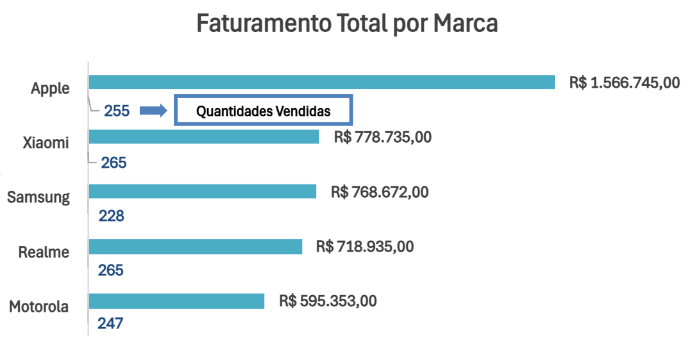

# Análise Por Marca

## Objetivo

Analisar o faturamento por marca e investigar os fatores que levaram a Apple a apresentar um faturamento significativamente superior às demais.

## Gráfico

### Faturamento por marca

**Figura 1.** Comparação do faturamento entre as marcas.

### Ticket médio por marca

**Figura 2.** Comparação do ticket médio entre as marcas.

## O que foi encontrado

* A Apple apresentou o maior faturamento entre todas as marcas analisadas, totalizando R$ 1.566.745,00.
* A liderança da Apple foi consistente ao longo dos meses analisados, não sendo resultado de um único período de vendas.
* Em quantidade de vendas, a Apple ocupou apenas a 3ª posição entre as marcas.
* A Apple apresentou o maior ticket médio da base, aproximadamente R$ 6.144,10 por venda.

## Insight

A hipótese inicial era que a Apple liderava o faturamento por vender mais unidades. Após a análise, foi identificado que sua liderança está relacionada ao elevado ticket médio de seus produtos.
Mesmo não ocupando a primeira posição em quantidade de vendas, o alto valor agregado dos aparelhos Apple foi suficiente para gerar o maior faturamento entre todas as marcas analisadas.

## Aprendizado

* Faturamento e quantidade de vendas são métricas diferentes e devem ser analisadas em conjunto.
* Nem sempre a marca que mais vende unidades é a que gera maior receita.
* O uso de métricas complementares, como ticket médio, permite compreender as causas dos resultados observados.
* Foi criada a métrica Ticket Médio, calculada pela fórmula:
* Ticket Médio = Faturamento ÷ Quantidade
* A análise do ticket médio permitiu validar a hipótese levantada durante a investigação do faturamento por marca.
