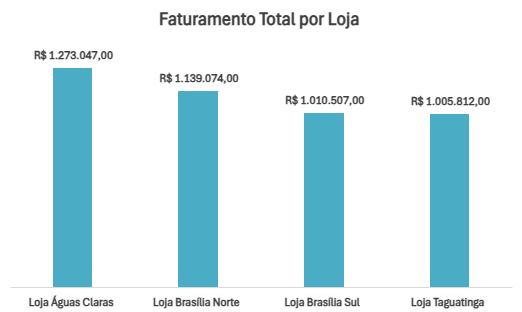
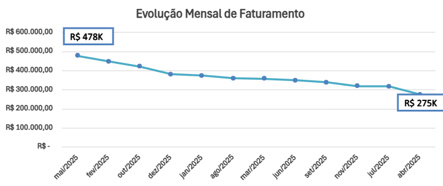
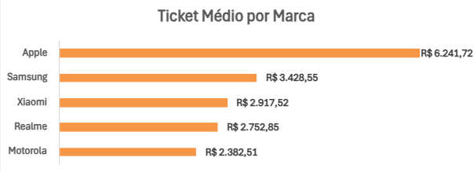
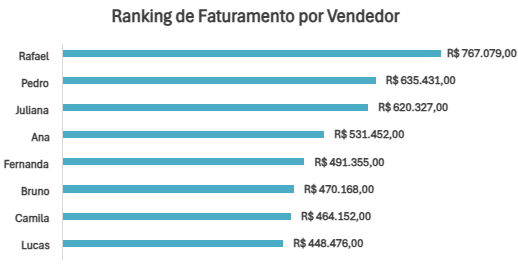
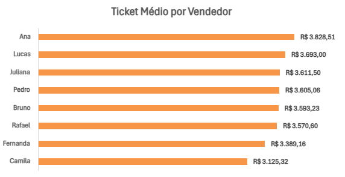

# Gráficos

## Objetivo

Criar visualizações para facilitar a interpretação dos resultados encontrados durante as análises realizadas no Excel.

## Gráficos criados

### Faturamento por loja

**Figura 1.** Comparação do faturamento entre as lojas.

### Faturamento por período

**Figura 2.** Evolução do faturamento ao longo dos meses.

### Faturamento por marca

**Figura 3.** Comparação do faturamento entre as marcas.

### Ticket médio por marca

**Figura 4.** Comparação do ticket médio entre as marcas.

### Faturamento por vendedor

**Figura 5.** Comparação do faturamento entre os vendedores.

### Ticket médio por vendedor

**Figura 6.** Comparação do ticket médio entre os vendedores.

## Aprendizado

A criação de gráficos facilitou a identificação de diferenças de desempenho entre lojas, marcas, vendedores e períodos.

Também foi possível utilizar métricas complementares, como o ticket médio, para compreender melhor os resultados de faturamento.
